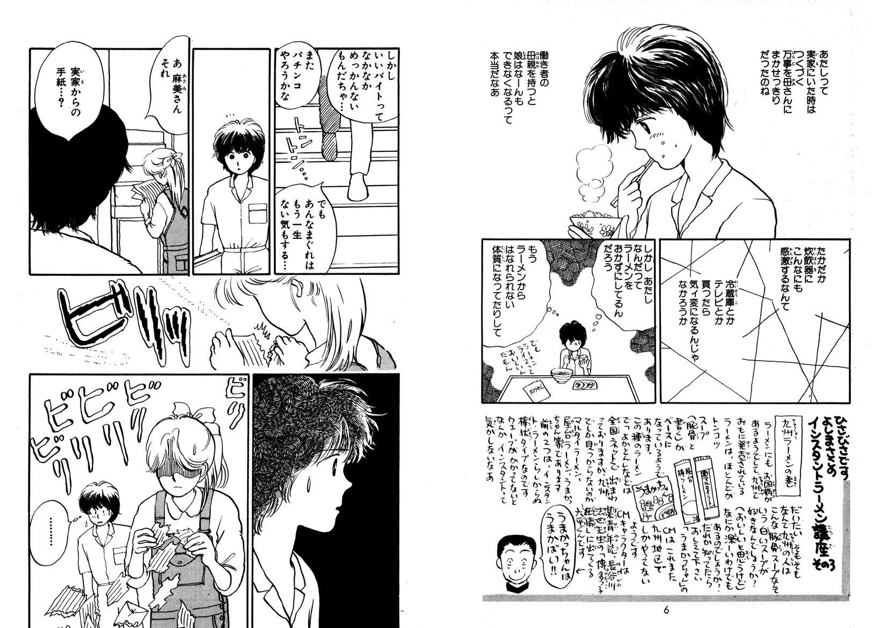
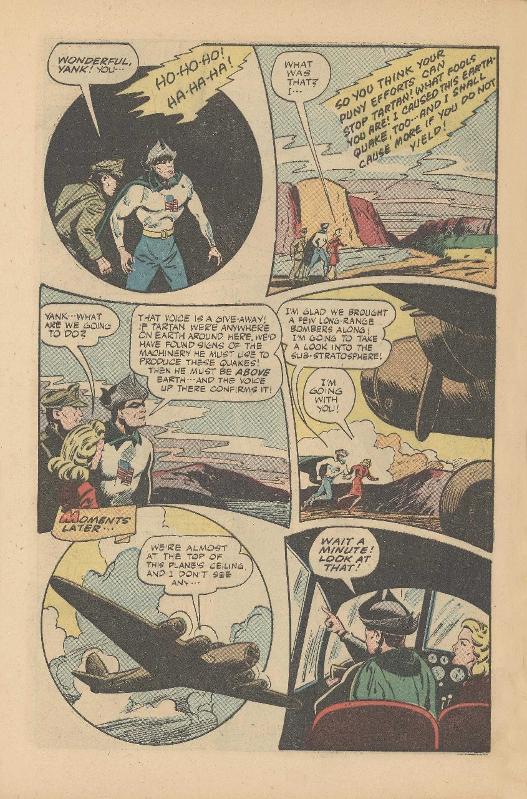
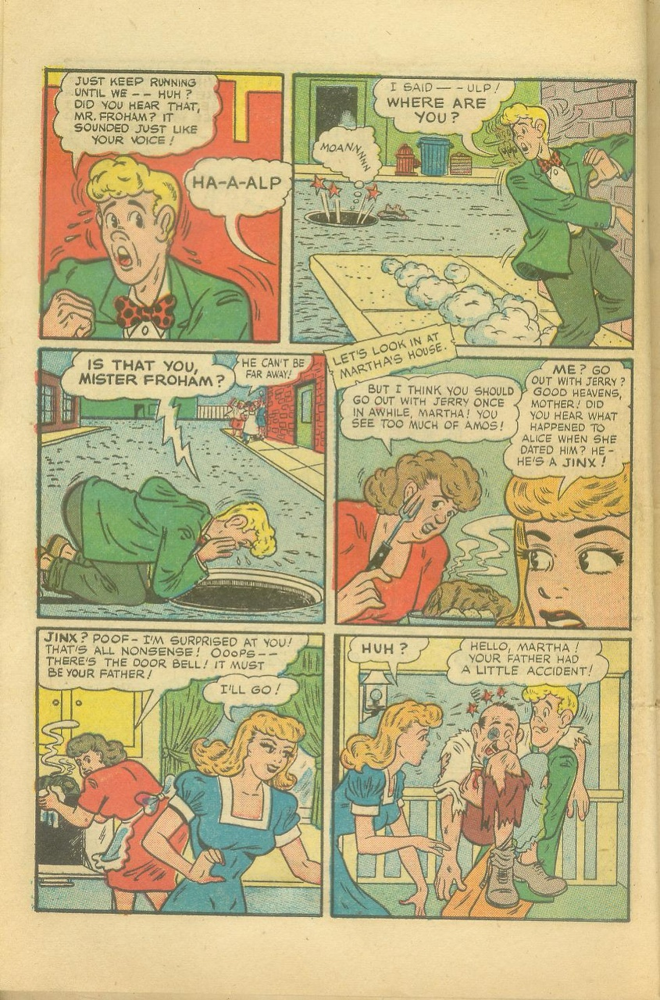

# BallonTranslator
 简体中文 | [English](doc/README_EN.md)  

深度学习辅助漫画翻译工具, 支持一键机翻和简单的图像/文本编辑  
## 下载
[国内网盘](https://cowtransfer.com/s/b336741eec834b)  | [Google Drive](https://drive.google.com/drive/folders/1uElIYRLNakJj-YS0Kd3r3HE-wzeEvrWd?usp=sharing)

界面预览

# Features
* 一键机翻  
  - 译文回填参考对原文排版的估计, 包括颜色, 轮廓, 角度, 朝向, 对齐方式等
  - 最后效果取决于文本检测, 识别, 抹字, 机翻四个模块的整体表现  
  - 支持日漫和美漫
* 图像编辑  
  支持掩膜编辑和修复画笔
  
* 文本编辑  
  支持富文本编辑和一些基础排版格式调整

# 说明

## 一键翻译
**建议在命令行终端下运行程序**, 首次运行请先配置好源语言/目标语言, 打开一个带图片的文件夹, 点击Run等待翻译完成  
  

### 一键翻译结果预览
|                                          Original                                           |         Translated          |
| :-----------------------------------------------------------------------------------------: | :-------------------------: |
|                 |  |
|  |  |
|  |  |
|                      |  | 
|                      |  | 

## 画板

暂时就一个修复画笔

## 文本编辑

文本编辑

## 界面说明及快捷键
* Ctrl+Z, Ctrl+Y可以撤销重做大部分操作，注意翻页后撤消重做栈会清空
* A/D翻页, 如果当前页面未保存会自动保存, 大图会卡一会
* 文本编辑模式下(底部最右"T"图标), W激活文本块创建模式后在画布右键拉文本框
* 画板模式下右下角滑条改原图透明度
* 底部左侧"OCR"和"A"按钮控制启用/禁用OCR翻译功能, 禁用后再Run程序就只做文本检测和抹字  
* 设置面板配置各自动化模块参数
  

## 自动化模块
本项目重度依赖[manga-image-translator](https://github.com/zyddnys/manga-image-translator), 在线服务器和模型训练需要费用, 有条件请考虑支持一下
- Ko-fi: <https://ko-fi.com/voilelabs>
- Patreon: <https://www.patreon.com/voilelabs>
- 爱发电: <https://afdian.net/@voilelabs>
  
### 文本检测
暂时仅支持日文(方块字都差不多)和英文检测, 训练代码和说明见https://github.com/dmMaze/comic-text-detector

### OCR
 * mit_32px模型来自manga-image-translator, 支持日英汉识别和颜色提取
 * [manga_ocr](https://github.com/kha-white/manga-ocr)来自[kha-white](https://github.com/kha-white), 支持日语识别, 注意选用该模型程序不会提取颜色

### 图像修复
  * AOT修复模型来自manga-image-translator
  * patchmatch是非深度学习算法, 也是PS修复画笔背后的算法, 实现来自[PyPatchMatch](https://github.com/vacancy/PyPatchMatch), 本程序用的是我的[修改版](https://github.com/dmMaze/PyPatchMatchInpaint)
  

### 翻译器

 * 谷歌翻译能挂代理建议把url从cn改成com
 * 彩云, 需要申请[token](https://dashboard.caiyunapp.com/)
 * papago  
 如需添加新的翻译器请参考[加别的翻译器](doc/加别的翻译器.md), 本程序添加新翻译器只需要继承基类实现两个接口即可不需要理会代码其他部分, 欢迎大佬提pr

## 杂
* 发布包包含pytorch和cuda所以那么大. 以后更新如果依赖库不做变动, 就只发布本体二进制/新配置文件/新模型, 下载后覆盖旧版本
* 如果电脑带N卡, 程序默认对所有模型启用GPU加速, 默认配置下显存占用在6G左右. 4G显存调小修复器inpaint_size即可. 

