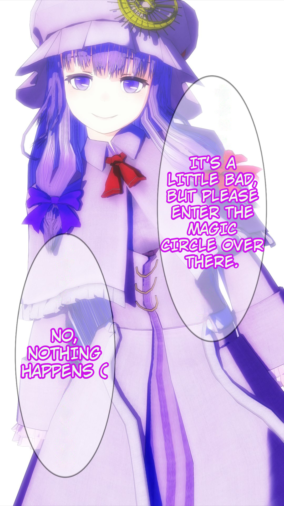
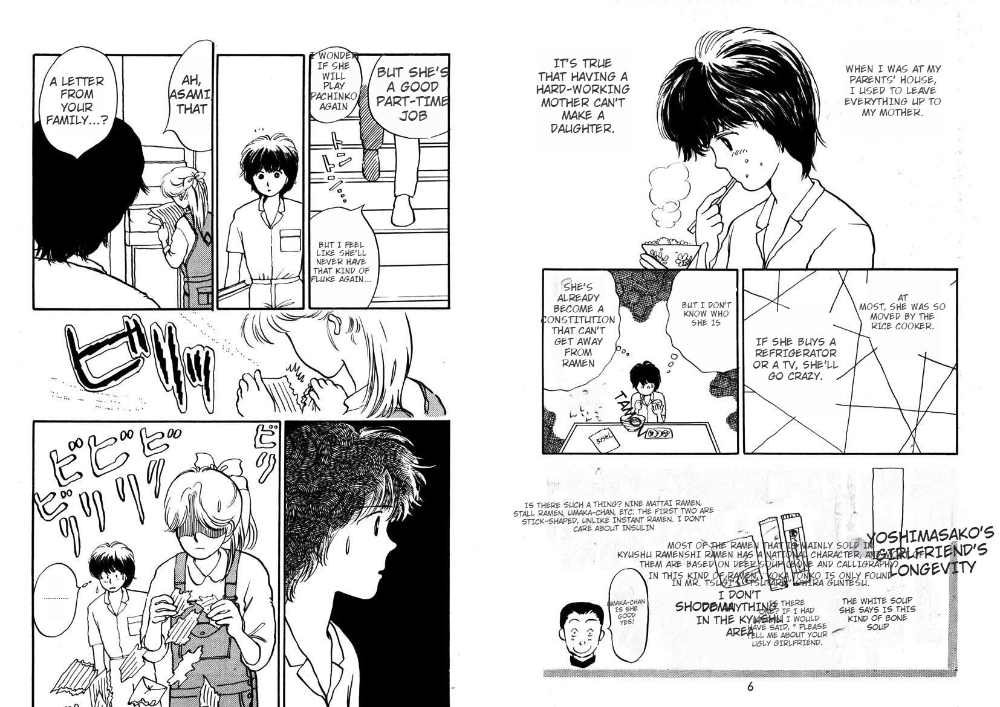

# BallonTranslator
[简体中文](README.md) | English | [Русский](README_RU.md) | [日本語](README_JA.md)

Yet another computer-aided comic/manga translation tool powered by deep learning.


<p align=center>
preview
</p>

# Features
* Fully automated translation  
  - Support automatic text-detection, recognition, removal, and translation, overall performance is dependent upon these modules.
  - lettering is based on the formatting estimation of the original text.
  - Works decently with manga and comics.
  - Improved manga->English, English->Chinese typesetting (based on the extraction of balloon regions.).
  
* Image editing  
  Support mask editing & inpainting (something like spot healing brush tool in PS) 
  
* Text editing  
  Support rich text formatting, translated texts can be edited interactively.

# Usage

Windows users can download Ballonstranslator-x.x.x-core.7z from [腾讯云](https://share.weiyun.com/xoRhz9i4) or [Google Drive](https://drive.google.com/drive/folders/1uElIYRLNakJj-YS0Kd3r3HE-wzeEvrWd?usp=sharing) and extract it to a folder named BallonTranslator, also download Ballonstranslator-x.x.x-patch.7z if there is any and extract it to the same folder.

## Run the source code

```bash
# First, you need to have Python(<=3.9 ) installed on your system.
$ python --version

# Clone this repo
$ git clone https://github.com/dmMaze/BallonsTranslator.git ; cd BallonsTranslator

# install requirements_macOS.txt on macOS
$ pip install -r requirements.txt
```

Install pytorch-cuda to enable GPU acceleration if you have a NVIDIA GPU.

```bash
pip install torch torchvision torchaudio --extra-index-url https://download.pytorch.org/whl/cu116
```

Download the **data** folder from https://drive.google.com/drive/folders/1uElIYRLNakJj-YS0Kd3r3HE-wzeEvrWd?usp=sharing and move it into BallonsTranslator/ballontranslator, finally run
```bash
python ballontranslator
```


To use Sugoi translator(Japanese-English only), download [offline model](https://drive.google.com/drive/folders/1KnDlfUM9zbnYFTo6iCbnBaBKabXfnVJm), move "sugoi_translator" into the BallonsTranslator/ballontranslator/data/models.  

## Fully automated translation
**It is recommended to run the program in a terminal in case it crashed and left no information, see the following gif.**, Please select the desired translator and set the source and target languages the first time you run the application. Open a folder containing images that need translation, click the "Run" button and wait for the process to complete.  
  

The font formats such as font size, color are determined by the program automatically in this process, you can predetermine those formats by change corresponding options from "decide by program" to "use global setting" in the config panel->Lettering.(global settings are those formats shown by the right font format panel when you are not editing any textblock in the scene)

## Image editing

### inpaint tool

<p align = "center">
Image editing mode, inpainting tool
</p>

### rect tool

<p align = "center">
rect tool
</p>

To 'erase' unwanted inpainted results, use the inpainting tool or rect tool with your **right button** pressed.  
The result depends on how accurately the algorithm ("method 1" and "method 2" in the gif) extracts the text mask. It could perform worse on complex text & background.  

## Text editing

<p align = "center">
Text editing mode
</p>


<p align=center>
batch text formatting & auto layout
</p>

## Shortcuts
* ```A```/```D``` or ```pageUp```/```Down``` to turn the page
* ```Ctrl+Z```, ```Ctrl+Y``` to undo/redo most operations, note the undo stack will be cleared after you turn the page.
* ```T``` to text-editting mode, (or the "T" button on the bottom toolbar) press W to activate text block creating mode, then drag the mouse on the canvas with the right button clicked to add a new text block. (see the text editing gif)
* ```P``` to image-editting mode.  
* In the image editing mode, use the slider on the right bottom to control the original image transparency.
* The "OCR" and "A" button in the bottom toolbar controls whether to enable OCR and translation, if you disable them, the program will only do the text detection and removal.  
* Set parameters of automatic modules in the config panel.  
* ```Ctrl++```/```Ctrl+-``` to resize image
* ```Ctrl+G```/```Ctrl+F``` to search globally/in current page.
  
  


# Automation modules
This project is heavily dependent upon [manga-image-translator](https://github.com/zyddnys/manga-image-translator), online service and model training is not cheap, please consider to donate the project:  
- Ko-fi: <https://ko-fi.com/voilelabs>
- Patreon: <https://www.patreon.com/voilelabs>
- 爱发电: <https://afdian.net/@voilelabs>  

Sugoi translator is created by [mingshiba](https://www.patreon.com/mingshiba).
  
## Text detection
Support English and Japanese text detection, training code and more details can be found at [comic-text-detector](https://github.com/dmMaze/comic-text-detector)

## OCR
 * mit_32px text recognition model is from manga-image-translator, support English and Japanese recognition and text color extraction.
 * mit_48px text recognition model is from manga-image-translator, support English, Japanese and Korean recognition and text color extraction.
 * [manga_ocr](https://github.com/kha-white/manga-ocr) is from [kha-white](https://github.com/kha-white), 

## Inpainting
  * AOT is from manga-image-translator
  * patchmatch is a non-dl algrithom from [PyPatchMatch](https://github.com/vacancy/PyPatchMatch), this program use a [modified version](https://github.com/dmMaze/PyPatchMatchInpaint) by me.
  

## Translators

 * Please change the goolge translator url from *.cn to *.com if you are not blocked by GFW.  
 * Caiyun translator need to require a [token](https://dashboard.caiyunapp.com/)
 * papago  
 * DeepL & Sugoi translator(and it's CT2 Translation conversion) thanks to [Snowad14](https://github.com/Snowad14)  

 To add a new translator, please reference [how_to_add_new_translator](doc/how_to_add_new_translator.md), it is simple as subclass a BaseClass and implementing two interfaces, then you can use it in the application, you are welcome to contribute to the project.  


## Misc
* If your computer has an Nvidia GPU, the program will enable cuda acceleration for all models by default, which requires around 6G GPU memory, you can turn down the inpaint_size in the config panel to avoid OOM. 
* Thanks to [bropines](https://github.com/bropines) for the Russian localisation.  

## Previews of fully automated translation results
|            Original            |         Translated (CHS)         |         Translated (ENG)         |
| :-----------------------------------------------------------------------------------------: | :-----------------------------------------------------------------------------------------: | :-----------------------------------------------------------------------------------------: |
||  |  |
||  |  |
|  |  |  |
|                      |  | |
