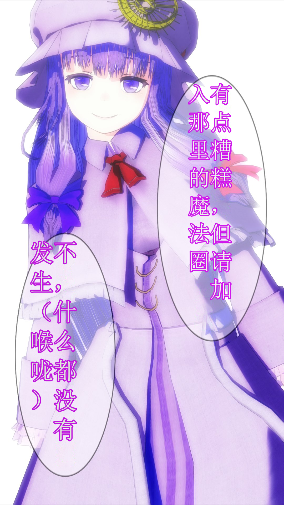
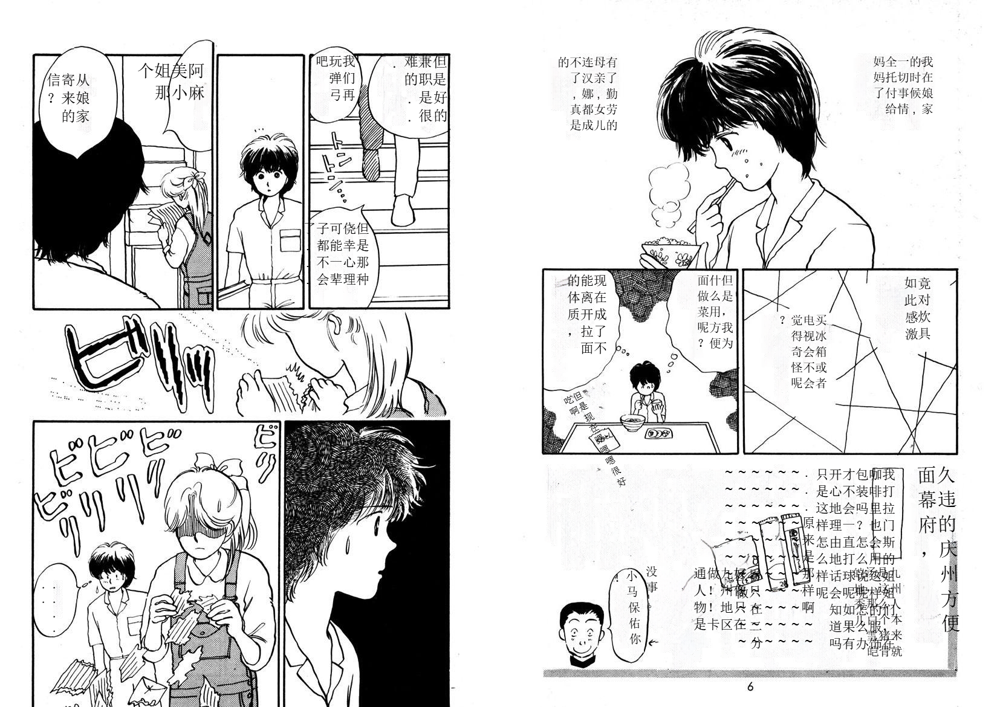
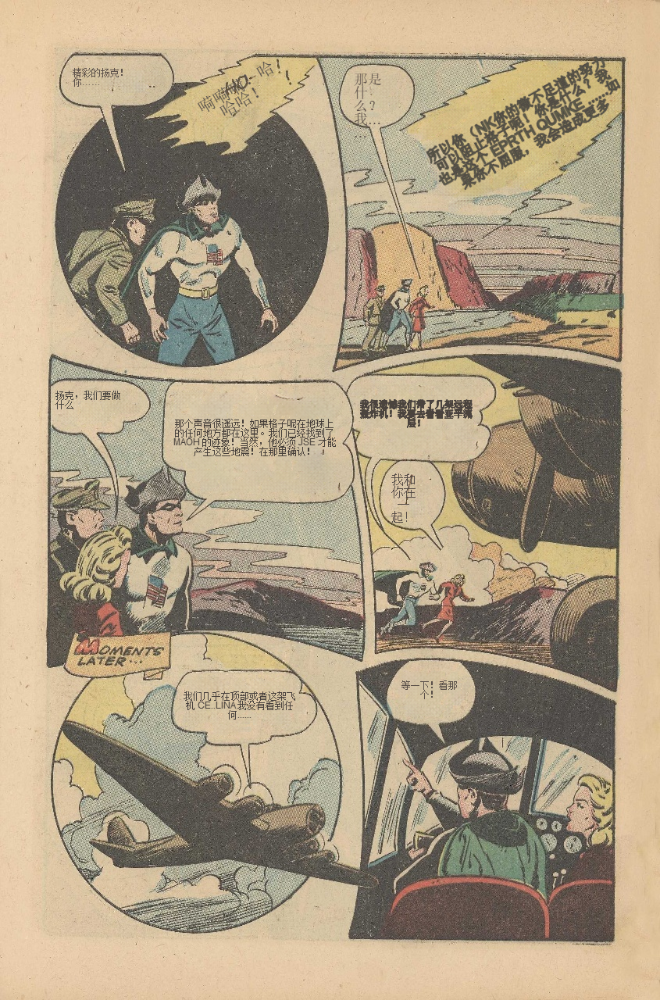
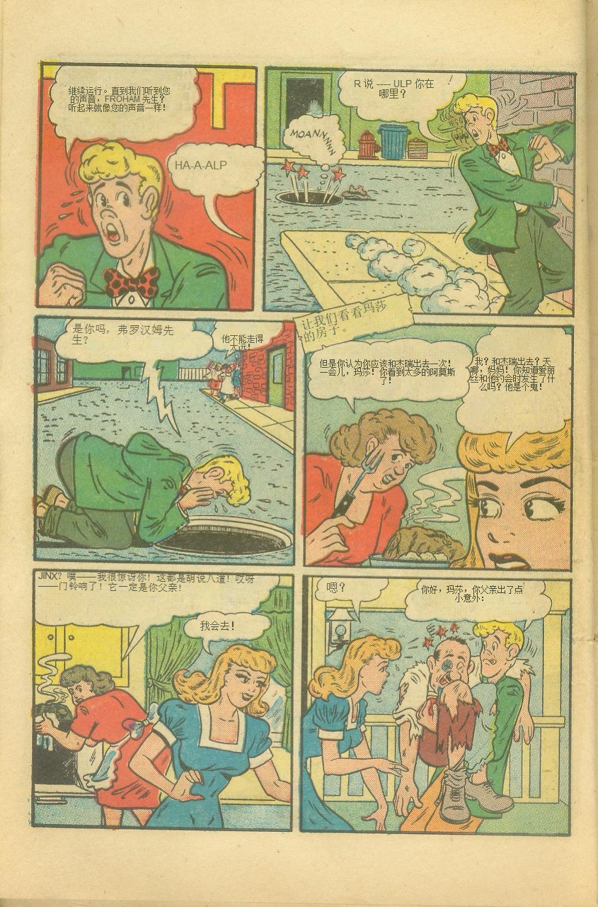

# BallonTranslator
[简体中文](README.md) | English  

Yet another computer-aided comic/manga translation tool powered by deep learning.
## Download
[国内网盘](https://cowtransfer.com/s/b336741eec834b)  | [Google Drive](https://drive.google.com/drive/folders/1uElIYRLNakJj-YS0Kd3r3HE-wzeEvrWd?usp=sharing)

preview

# Features
* Fully automated translation  
  - Support automatic text-detection, recognition, removal, and translation, overall performance is dependent upon these modules.
  - lettering is based on the formatting estimation of the original text.
  - Works decently with manga and comics.
  
* Image editing  
  Support mask editing & inpainting (something like spot healing brush tool in PS) 
  
* Text editing  
  Support rich text formatting.

# Usage

## Fully automated translation
**It is recommended to run the program in a terminal in case it crashed and left no information, see the following gif.**, Please select the desired translator and set the source and target languages the first time you run the application. Open a folder containing images that need translation, click the "Run" button and wait for the process to complete.
  

### Previews of fully automated translation results
|                                          Original                                           |         Translated          |
| :-----------------------------------------------------------------------------------------: | :-------------------------: |
|                 |  |
|  |  |
|  |  |
|                      |  | 
|                      |  | 

## Image editing

### inpaint tool

Image editing mode, inpainting tool

### rect tool

rect tool

Drag the rectangle with left button pressed to erase the text inside the box, press right button and drag to clear inpainted result.  
The result depends on how accurately the algorithm ("method 1" and "method 2" in the gif) extracts the text mask. It could perform worse on complex text & background.  

## Text editing

Text editing mode

## Shortcuts
* A/D to turn the page
* Ctrl+Z, Ctrl+Y to undo/redo most operations, note the undo stack will be cleared after you turn the page.
* T to text-editting mode, (or the "T" button on the bottom toolbar) press W to activate text block creating mode, then drag the mouse on the canvas with the right button clicked to add a new text block. (see the text editing gif)
* P to image-editting mode.  
* In the image editing mode, use the slider on the right bottom to control the original image transparency.
* The "OCR" and "A" button in the bottom toolbar controls whether to enable OCR and translation, if you disable them, the program will only do the text detection and removal.  
* Set parameters of automatic modules in the config panel.  
* Ctrl++/ to resize image
  
  

## Automation modules
This project is heavily dependent upon [manga-image-translator](https://github.com/zyddnys/manga-image-translator), online service and model training is not cheap, please consider to donate the project:  
- Ko-fi: <https://ko-fi.com/voilelabs>
- Patreon: <https://www.patreon.com/voilelabs>
- 爱发电: <https://afdian.net/@voilelabs>
  
### Text detection
Support English and Japanese text detection, training code and more details can be found at [comic-text-detector](https://github.com/dmMaze/comic-text-detector)

### OCR
 * mit_32px text recognition model is from manga-image-translator, support English and Japanese recognition and text color extraction.
 * [manga_ocr](https://github.com/kha-white/manga-ocr) is from [kha-white](https://github.com/kha-white), 

### Inpainting
  * AOT is from manga-image-translator
  * patchmatch is a non-dl algrithom from [PyPatchMatch](https://github.com/vacancy/PyPatchMatch), this program use a [modified version](https://github.com/dmMaze/PyPatchMatchInpaint) by me.
  

### Translators

 * Please change the goolge translator url from *.cn to *.com if you are not blocked by GFW.  
 * Caiyun translator need to require a [token](https://dashboard.caiyunapp.com/)
 * papago  
 To add a new translator, please reference [加别的翻译器](./加别的翻译器.md), it is simple as subclass a BaseClass and implementing two interfaces, then you can use it in the application, you are welcome to contribute to the project.  

## Misc
* The release package contains PyTorch and cuda. For future updates, if no changes are made to the dependencies, only the new exe and models will be released, copy them to the program folder to get the grogram updated. 
* If your computer has an Nvidia GPU, the program will enable cuda acceleration for all models by default, which requires around 6G GPU memory, you can turn down the inpaint_size in the config panel to avoid OOM. 

# TODO
- Optimize for cpu
- New models to support more languages
- ...
