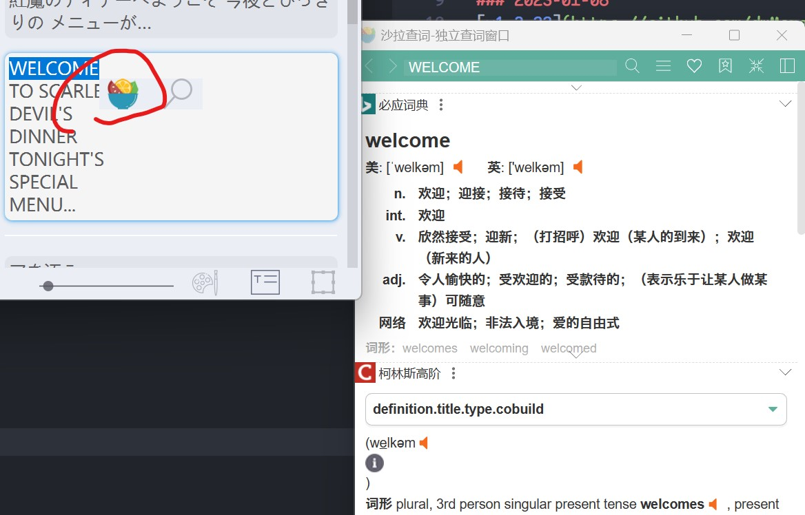
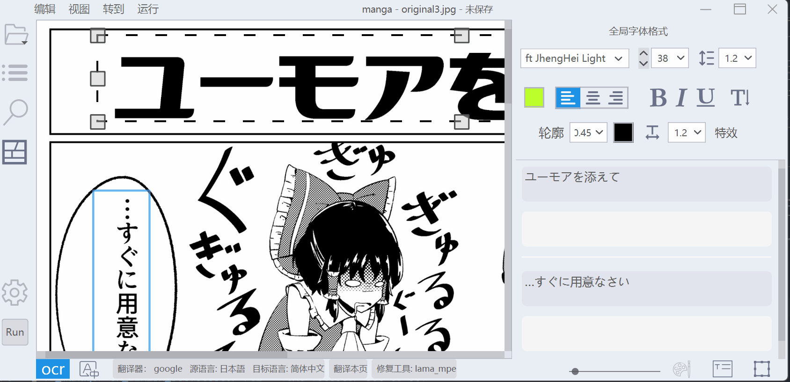
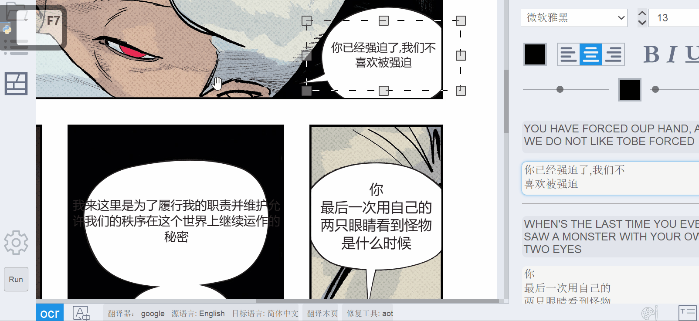

# Changelogs

### 2023-04-15
支持从某些源站下载/更新图片，感谢[ROKOLYT](https://github.com/ROKOLYT)

### 2023-02-27
[v1.3.34](https://github.com/dmMaze/BallonsTranslator/releases/tag/v1.3.34) 发布
1. 修复繁体直排bug (#96)
2. 彩云和deepl目标语言支持繁体 (#100)
3. 支持读取.webp图片 (#85)

### 2023-02-23
[v1.3.30](https://github.com/dmMaze/BallonsTranslator/releases/tag/v1.3.30) 发布
1. 从PyQt5换到PyQt6以支持更好的嵌字预览, [避免PyQt5与nuitka的线程兼容性问题](https://github.com/Nuitka/Nuitka/issues/251)
2. 支持改变嵌字层透明度 (#88) 注意只是预览, 不会改变渲染结果, 嵌字透明度在右侧菜单效果里改
3. log文件写进data/logs

### 2023-01-27
[v1.3.26](https://github.com/dmMaze/BallonsTranslator/releases/tag/v1.3.26) 发布
1. 选中文本迷你菜单支持*聚合词典专业划词翻译*[沙拉查词](https://saladict.crimx.com): [安装说明](doc/saladict_chs.md)

2. 支持替换OCR和机翻结果中的关键字, 见编辑菜单或设置面板 [#78](https://github.com/dmMaze/BallonsTranslator/issues/78)
3. 支持拖拽导入文件夹 [#77](https://github.com/dmMaze/BallonsTranslator/issues/77)
4. 编辑文本时隐藏控制小方块 [#81](https://github.com/dmMaze/BallonsTranslator/issues/81)
5. 修Bug

### 2023-01-08
[v1.3.22](https://github.com/dmMaze/BallonsTranslator/releases/tag/v1.3.22) 发布
1. 支持删除并恢复被抹除文字
2. 支持角度复位
3. 修Bug

### 2022-12-30
[v1.3.20](https://github.com/dmMaze/BallonsTranslator/releases/tag/v1.3.20)发布
1. 适应具有极端宽高比的图片比如条漫
2. 支持粘贴到多个选中的文本编辑框
3. 修bug
4. OCR/翻译/修复选中文字区域, 填字样式会继承选中的文字框自己的
   单行文本建议选用ctc_48px, 多行日文选mangocr, 目前对多行其它语言不太行, 需要重新训练检测模型  
   注意如果用**ctc_48px**要保证框在竖排模式下且尽可能贴合单行文本

### 2022-11-29
[v1.3.15](https://github.com/dmMaze/BallonsTranslator/releases/tag/v1.3.15)发布
1. 修bug
2. 优化保存逻辑
3. 画笔现在可以改成方形(实验)

### 2022-10-25
[v1.3.14](https://github.com/dmMaze/BallonsTranslator/releases/tag/v1.3.14)发布
1. 修bug

### 2022-09-30
v1.3.13起支持深色模式: 视图->深色模式

### 2022-09-24
[v1.3.12](https://github.com/dmMaze/BallonsTranslator/releases/tag/v1.3.12)发布

1. 支持全局(Ctrl+G)/当前页(Ctrl+F)查找替换
2. 原来的文本编辑器局部撤销重做并入全局文本编辑撤销重做栈, 画板撤销重做现在和文本编辑分离
3. Word文档导入导出bug修复
4. 基于 https://github.com/zhiyiYo/PyQt-Frameless-Window 重写无边框窗口

### 2022-09-13
[v1.3.8](https://github.com/dmMaze/BallonsTranslator/releases/tag/v1.3.8)发布

1. 画笔工具修复及优化
2. 修正界面缩放
3. 支持添加自定义字体样式预设, 支持调整文字透明度和阴影, 详见https://github.com/dmMaze/BallonsTranslator/pull/38
4. 支持导入导出word文档, 支持打开*.json项目文件, 详见https://github.com/dmMaze/BallonsTranslator/pull/40

### 2022-08-31
[v1.3.4](https://github.com/dmMaze/BallonsTranslator/releases/tag/v1.3.4)发布

1. 添加离线日译英模型Sugoi Translator(仅日译英, 作者[mingshiba](https://www.patreon.com/mingshiba), 已获得集成授权), 感谢[@Snowad14](https://github.com/Snowad14)提供CT2转换模型
2. 来自[bropines](https://github.com/bropines)的俄语本地化支持
3. 文本编辑支持字距调节
4. 调整竖排符号及半角字符位置规则, 详见https://github.com/dmMaze/BallonsTranslator/pull/30

### 2022-08-17
[v1.3.0](https://github.com/dmMaze/BallonsTranslator/releases/tag/v1.3.0)发布

1. 修复DeepL翻译器的bug, 感谢[@Snowad14](https://github.com/Snowad14)
2. 修复部分字体偏小+轮廓导致看不清的问题
3. 支持**全局字体格式**(一键机翻字体格式): 在控制面板->嵌字菜单里将相应项从"由程序决定"改为"使用全局设置"后启用. 注意全局设置就是未编辑任何文本块时右侧字体格式面板的那些设置.  
4. 添加**新的修复模型**: lama-mpe (默认启用)
5. 文本块支持多选和**批量调整格式** (ctrl+鼠标左键或者按下右键拉框框选)
6. 支持日译英, 英译中的**自动排版**, 基于提取出的背景气泡, 目标语言为中文时会自动断句(基于pkuseg). 勾选设置面板->常规->嵌字->自动排版后将对一键机翻生效(默认启用). 

批量格式调整, 英译中自动断句分行

### 2022-05-19
[v1.2.0](https://github.com/dmMaze/BallonsTranslator/releases/tag/v1.2.0)发布

1. 支持DeepL翻译器, 感谢[@Snowad14](https://github.com/Snowad14)
2. 增加来自manga-image-translator的新OCR模型, 支持韩语识别
3. 修bug

### 2022-04-17
[v1.1.0](https://github.com/dmMaze/BallonsTranslator/releases/tag/v1.1.0)发布

1. 用qthread存编辑图片, 避免翻页卡顿
2. 图像修复策略优化: 
   - 修复算法和**CPU模式**下的修复模型输入由整张图片改为文本块
   - 可选由程序自动评估当前块是否有必要调用开销大的修复方法, 在设置-图像修复启用/禁用, 启用后纯色背景对话泡将会由计算出的背景色直接填充  
  
    优化后图像修复阶段速度提升至原来的2x-5x不等

3. 添加矩形工具
4. 更多快捷键
5. 修bug

### 2022-04-09
v1.0.0发布