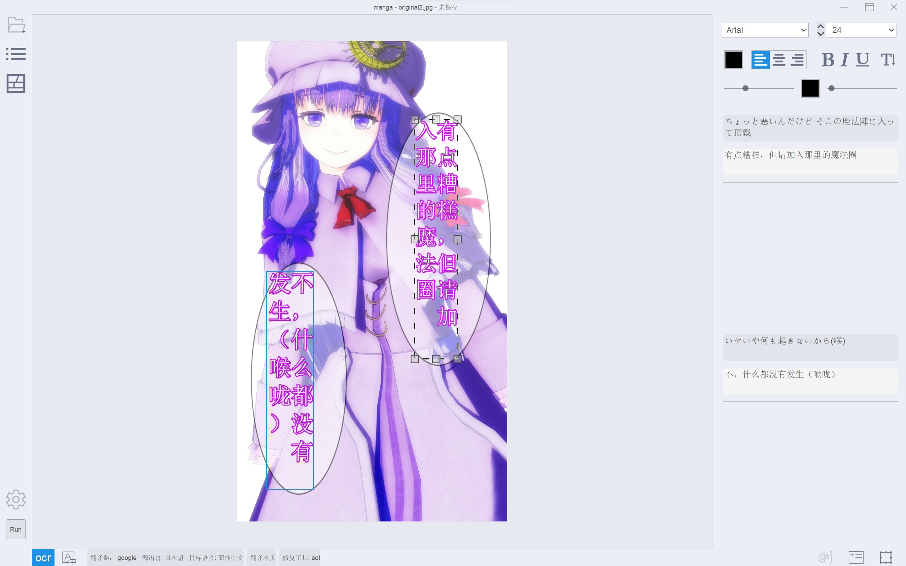
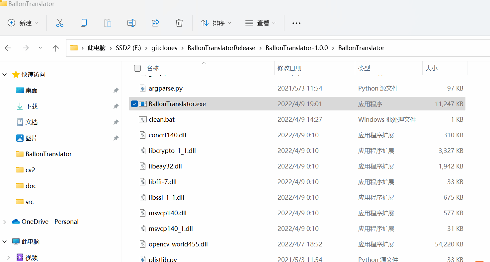
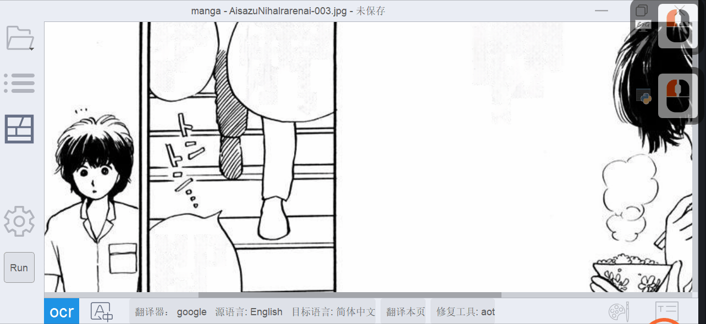
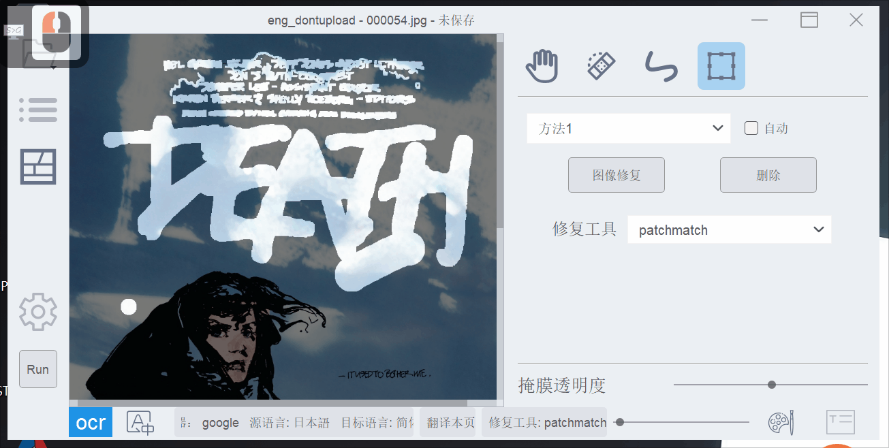
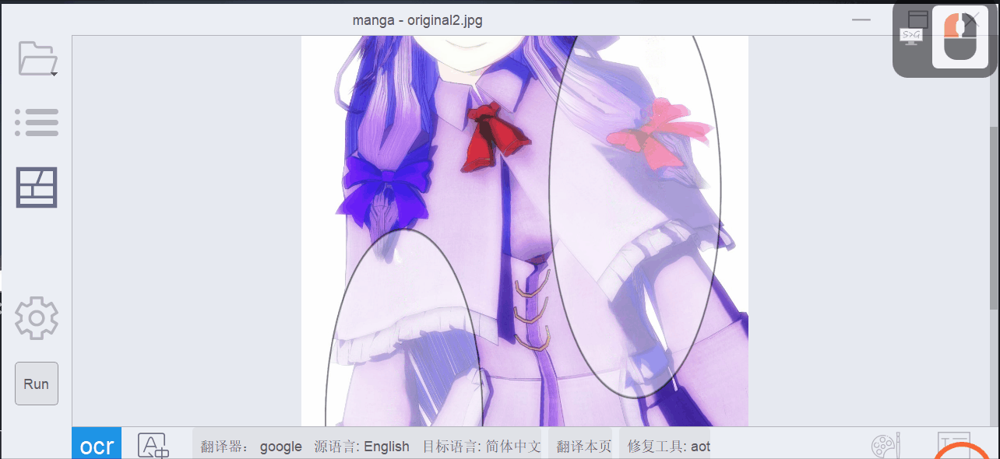
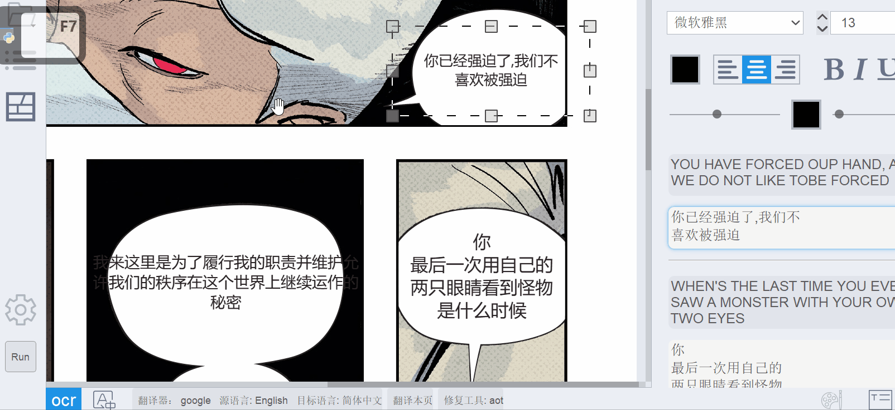
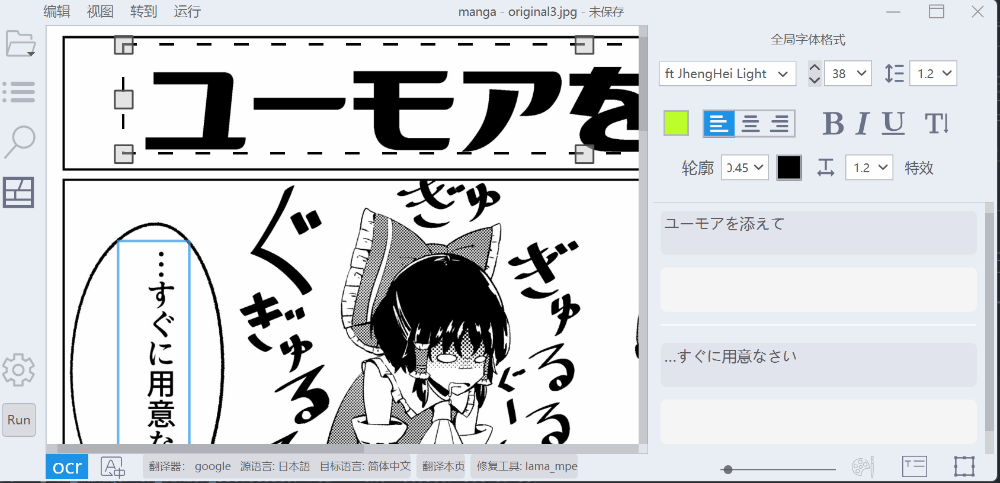
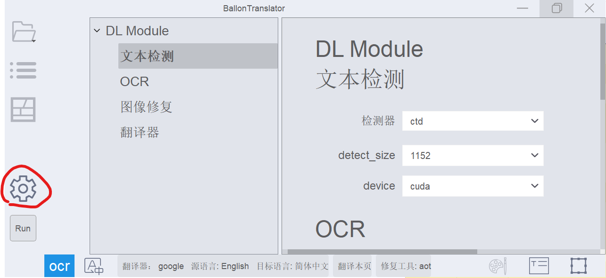

## BallonTranslator

[简体中文](/README.md) | [English](/README_EN.md) | [Русский](/doc/README_RU.md) | [日本語](/doc/README_JA.md) | [Español](/doc/README_ES.md) | [Français](/doc/README_FR.md) | [pt-BR](/doc/README_PT-BR.md) | [한국어](/doc/README_KO.md) | [Indonesia](/doc/README_ID.md) | [Tiếng Việt](/doc/README_VI.md)

BallonTranslator é mais uma ferramenta auxiliada por computador, alimentada por deep learning, para a tradução de quadrinhos/mangás.



<p align=center>
**Pré-Visualização**
</p>

## Recursos
* **Tradução totalmente automatizada:** 
  - Detecta, reconhece, remove e traduz textos automaticamente. O desempenho geral depende desses módulos.
  - A diagramação é baseada na estimativa de formatação do texto original.
  - Funciona bem com mangás e quadrinhos.
  - Diagramação aprimorada para mangás->inglês, inglês->chinês (baseado na extração de regiões de balões).
  
* **Edição de imagem:**
  - Permite editar máscaras e inpainting (similar à ferramenta Pincel de Recuperação para Manchas no Photoshop).
  - Adaptado para imagens com proporção de aspecto extrema, como webtoons.
  
* **Edição de texto:**
  - Suporta formatação de texto e [predefinições de estilo de texto](https://github.com/dmMaze/BallonsTranslator/pull/311). Textos traduzidos podem ser editados interativamente.
  - Permite localizar e substituir.
  - Permite exportar/importar para/de documentos do Word.

## Instalação

### No Windows

### No Windows
Se você não deseja instalar o Python e configurar o ambiente manualmente:

**Método A (Configuração automática do ambiente local em um clique, requer PowerShell)**:
O script criará automaticamente uma pasta `BallonsTranslator` no diretório atual, baixará o código-fonte mais recente, configurará um ambiente Python 3.12 isolado, instalará todas as dependências principais e iniciará o aplicativo (requer o PowerShell habilitado no sistema):
```powershell
irm https://raw.githubusercontent.com/dmMaze/BallonsTranslator/dev/scripts/install.ps1 | iex
```
Ou execute o seguinte comando no Prompt de Comando clássico (`cmd.exe`):
```cmd
powershell -NoProfile -ExecutionPolicy Bypass -Command "irm https://raw.githubusercontent.com/dmMaze/BallonsTranslator/dev/scripts/install.ps1 | iex"
```

Se você já clonou o repositório, basta clicar duas vezes no arquivo **`scripts/install.bat`** dentro da sua pasta clonada para configurar o ambiente localmente. Depois de concluído, execute `launch_win.bat` na pasta raiz para iniciar o aplicativo.

**Método B (Baixar pacote pré-configurado)**:
Baixe o arquivo `Ballonstranslator_win_minium.zip` mais recente em [GitHub Releases](https://github.com/dmMaze/BallonsTranslator/releases), extraia-o para qualquer pasta e clique duas vezes em `launch_win.bat` para iniciar o aplicativo.
*(Nota: As compilações empacotadas não oferecem suporte ao Windows 7; os usuários do Windows 7 devem instalar o [Python 3.8](https://www.python.org/downloads/release/python-3810/) manualmente e executar a partir do código-fonte).*
### Executando o código-fonte
Instale o [Python](https://www.python.org/downloads/release/python-31011) **<= 3.12** (não utilize a versão da Microsoft Store) e o [Git](https://git-scm.com/downloads).

```bash
# Clone este repositório
$ git clone https://github.com/dmMaze/BallonsTranslator.git ; cd BallonsTranslator

# Inicie o aplicativo
$ python3 launch.py
```

Na primeira execução, as bibliotecas necessárias serão instaladas e os modelos serão baixados automaticamente. Se os downloads falharem, você precisará baixar a pasta **data** (ou os arquivos ausentes mencionados no terminal) do [MEGA](https://mega.nz/folder/gmhmACoD#dkVlZ2nphOkU5-2ACb5dKw) ou [Google Drive](https://drive.google.com/drive/folders/1uElIYRLNakJj-YS0Kd3r3HE-wzeEvrWd?usp=sharing) e salvá-la no caminho correspondente na pasta do código-fonte.

## Construindo o aplicativo para macOS (compatível com chips Intel e Apple Silicon)

*Observação: o macOS também pode executar o código-fonte caso o aplicativo não funcione.*


#### 1. Preparação
-  Baixe as bibliotecas e modelos do [MEGA](https://mega.nz/folder/gmhmACoD#dkVlZ2nphOkU5-2ACb5dKw) ou [Google Drive](https://drive.google.com/drive/folders/1uElIYRLNakJj-YS0Kd3r3HE-wzeEvrWd?usp=sharing).


-  Coloque todos os recursos baixados em uma pasta chamada `data`. A estrutura final do diretório deve ser semelhante a esta:
  
```
data
├── libs
│   └── patchmatch_inpaint.dll
└── models
    ├── aot_inpainter.ckpt
    ├── comictextdetector.pt
    ├── comictextdetector.pt.onnx
    ├── lama_mpe.ckpt
    ├── manga-ocr-base
    │   ├── README.md
    │   ├── config.json
    │   ├── preprocessor_config.json
    │   ├── pytorch_model.bin
    │   ├── special_tokens_map.json
    │   ├── tokenizer_config.json
    │   └── vocab.txt
    ├── mit32px_ocr.ckpt
    ├── mit48pxctc_ocr.ckpt
    └── pkuseg
        ├── postag
        │   ├── features.pkl
        │   └── weights.npz
        ├── postag.zip
        └── spacy_ontonotes
            ├── features.msgpack
            └── weights.npz

7 diretórios, 23 arquivos
```

- Instale a ferramenta de linha de comando pyenv para gerenciar as versões do Python. Recomenda-se a instalação via Homebrew.

```
# Instalar via Homebrew
brew install pyenv

# Instalar via script oficial
curl https://pyenv.run | bash

# Configurar o ambiente shell após a instalação
echo 'export PYENV_ROOT="$HOME/.pyenv"' >> ~/.zshrc
echo 'command -v pyenv >/dev/null || export PATH="$PYENV_ROOT/bin:$PATH"' >> ~/.zshrc
echo 'eval "$(pyenv init -)"' >> ~/.zshrc
```

#### 2. Construindo o aplicativo
```
# Entre no diretório de trabalho `data`
cd data

# Clone o branch `dev` do repositório
git clone -b dev https://github.com/dmMaze/BallonsTranslator.git

# Entre no diretório de trabalho `BallonsTranslator`
cd BallonsTranslator

# Execute o script de construção, que solicitará a senha na etapa pyinstaller, insira a senha e pressione enter
sh scripts/build-macos-app.sh
```

> 📌 O aplicativo empacotado está em ./data/BallonsTranslator/dist/BallonsTranslator.app. Arraste o aplicativo para a pasta de aplicativos do macOS para instalar. Pronto para usar sem configurações extras do Python.


</details>

Para usar o Sugoi translator (apenas japonês-inglês), baixe o [modelo offline](https://drive.google.com/drive/folders/1KnDlfUM9zbnYFTo6iCbnBaBKabXfnVJm) e mova a pasta "sugoi_translator" para BallonsTranslator/ballontranslator/data/models.


# Utilização

**É recomendado executar o programa em um terminal caso ocorra alguma falha e não sejam fornecidas informações, como mostrado no gif a seguir.**
  

- Na primeira execução, selecione o tradutor e defina os idiomas de origem e destino clicando no ícone de configurações.
- Abra uma pasta contendo as imagens do quadrinho (mangá/manhua/manhwa) que precisa de tradução clicando no ícone de pasta.
- Clique no botão `Run` e aguarde a conclusão do processo.

Os formatos de fonte, como tamanho e cor, são determinados automaticamente pelo programa neste processo. Você pode pré-determinar esses formatos alterando as opções correspondentes de "decidir pelo programa" para "usar configuração global" no painel de configurações->Diagramação. (As configurações globais são os formatos exibidos no painel de formatação de fonte à direita quando você não está editando nenhum bloco de texto na cena.)

## Edição de Imagem

### Ferramenta de Inpainting

<p align = "center">
**Modo de edição de imagem, ferramenta de Inpainting**
</p>

### Ferramenta Retângulo

<p align = "center">
**Ferramenta Retângulo**
</p>

Para 'apagar' resultados indesejados de inpainting, use a ferramenta de inpainting ou a ferramenta retângulo com o **botão direito do mouse** pressionado. O resultado depende da precisão com que o algoritmo ("método 1" e "método 2" no gif) extrai a máscara de texto. O desempenho pode ser pior em textos e fundos complexos.

## Edição de Texto

<p align = "center">
**Modo de edição de texto**
</p>


<p align=center>
**Formatação de texto em lote e layout automático**
</p>


<p align=center>
**OCR e tradução de área selecionada**
</p>

## Atalhos
* `A`/`D` ou `pageUp`/`Down` para virar a página
* `Ctrl+Z`, `Ctrl+Shift+Z` para desfazer/refazer a maioria das operações (a pilha de desfazer é limpa ao virar a página).
* `T` para o modo de edição de texto (ou o botão "T" na barra de ferramentas inferior).
* `W` para ativar o modo de criação de bloco de texto, arraste o mouse na tela com o botão direito pressionado para adicionar um novo bloco de texto (veja o gif de edição de texto).
* `P` para o modo de edição de imagem.
* No modo de edição de imagem, use o controle deslizante no canto inferior direito para controlar a transparência da imagem original.
* Desative ou ative qualquer módulo automático através da barra de título->executar. Executar com todos os módulos desativados irá refazer as letras e renderizar todo o texto de acordo com as configurações correspondentes.
* Defina os parâmetros dos módulos automáticos no painel de configuração.
* `Ctrl++`/`Ctrl+-` (Também `Ctrl+Shift+=`) para redimensionar a imagem.
* `Ctrl+G`/`Ctrl+F` para pesquisar globalmente/na página atual.
* `0-9` para ajustar a opacidade da camada de texto.
* Para edição de texto: negrito - `Ctrl+B`, sublinhado - `Ctrl+U`, itálico - `Ctrl+I`.
* Defina a sombra e a transparência do texto no painel de estilo de texto -> Efeito.



## Modo Headless (Executar sem interface gráfica)

```python
python launch.py --headless --exec_dirs "[DIR_1],[DIR_2]..."
```

A configuração (idioma de origem, idioma de destino, modelo de inpainting, etc.) será carregada de config/config.json. Se o tamanho da fonte renderizada não estiver correto, especifique o DPI lógico manualmente através de `--ldpi`. Os valores típicos são 96 e 72.

## Módulos de Automação
Este projeto depende fortemente do [manga-image-translator](https://github.com/zyddnys/manga-image-translator). Serviços online e treinamento de modelos não são baratos, considere fazer uma doação ao projeto:
- Ko-fi: [https://ko-fi.com/voilelabs](https://ko-fi.com/voilelabs)
- Patreon: [https://www.patreon.com/voilelabs](https://www.patreon.com/voilelabs)
- 爱发电: [https://afdian.net/@voilelabs](https://afdian.net/@voilelabs)

O [Sugoi translator](https://sugoitranslator.com/) foi criado por [mingshiba](https://www.patreon.com/mingshiba).

## Detecção de Texto
* Suporta detecção de texto em inglês e japonês. O código de treinamento e mais detalhes podem ser encontrados em [comic-text-detector](https://github.com/dmMaze/comic-text-detector).
* Suporta o uso de detecção de texto do [Starriver Cloud (Tuanzi Manga OCR)](https://cloud.stariver.org.cn/). O nome de usuário e a senha precisam ser preenchidos, e o login automático será realizado a cada vez que o programa for iniciado.
  * Para instruções detalhadas, consulte [Manual do TuanziOCR](../doc/Manual_TuanziOCR_pt-BR.md).

## OCR
* Todos os modelos mit* são do manga-image-translator e suportam reconhecimento de inglês, japonês e coreano, além da extração da cor do texto.
* [manga_ocr](https://github.com/kha-white/manga-ocr) é de [kha-white](https://github.com/kha-white), reconhecimento de texto para japonês, com foco principal em mangás japoneses.
* Suporta o uso de OCR do [Starriver Cloud (Tuanzi Manga OCR)](https://cloud.stariver.org.cn/). O nome de usuário e a senha precisam ser preenchidos, e o login automático será realizado a cada vez que o programa for iniciado.
  * A implementação atual usa OCR em cada bloco de texto individualmente, resultando em velocidade mais lenta e sem melhoria significativa na precisão. Não é recomendado. Se necessário, use o Tuanzi Detector.
  * Ao usar o Tuanzi Detector para detecção de texto, recomenda-se definir o OCR como none_ocr para ler o texto diretamente, economizando tempo e reduzindo o número de solicitações.
  * Para instruções detalhadas, consulte [Manual do TuanziOCR](../doc/Manual_TuanziOCR_pt-BR.md).

## Inpainting
* O AOT é do [manga-image-translator](https://github.com/zyddnys/manga-image-translator).
* Todos os lama* são ajustados usando o [LaMa](https://github.com/advimman/lama).
* PatchMatch é um algoritmo do [PyPatchMatch](https://github.com/vacancy/PyPatchMatch). Este programa usa uma [versão modificada](https://github.com/dmMaze/PyPatchMatchInpaint) por mim.

## Tradutores
Tradutores disponíveis: Google, DeepL, ChatGPT, Sugoi, Caiyun, Baidu, Papago e Yandex.
* O Google desativou o serviço de tradução na China, defina a 'url' correspondente no painel de configuração para *.com.
* Os tradutores [Caiyun](https://dashboard.caiyunapp.com/), [ChatGPT](https://platform.openai.com/playground), [Yandex](https://yandex.com/dev/translate/), [Baidu](http://developers.baidu.com/) e [DeepL](https://www.deepl.com/docs-api/api-access) exigem um token ou chave de API.
* DeepL e Sugoi translator (e sua conversão CT2 Translation) graças a [Snowad14](https://github.com/Snowad14).
* Sugoi traduz do japonês para o inglês completamente offline.
* [Sakura-13B-Galgame](https://github.com/SakuraLLM/Sakura-13B-Galgame)

Para adicionar um novo tradutor, consulte [Como_add_um_novo_tradutor](../doc/Como_add_um_novo_tradutor.md). É simples como criar uma subclasse de uma classe base e implementar duas interfaces. Em seguida, você pode usá-lo no aplicativo. Contribuições para o projeto são bem-vindas.

## FAQ & Diversos
* Se o seu computador tiver uma GPU Nvidia ou Apple Silicon, o programa habilitará a aceleração de hardware.
* Adicione suporte para [saladict](https://saladict.crimx.com) (*Dicionário pop-up profissional e tradutor de páginas tudo-em-um*) no mini menu ao selecionar o texto. [Guia de instalação](../doc/saladict_pt-br.md).
* Acelere o desempenho se você tiver um dispositivo [NVIDIA CUDA](https://pytorch.org/docs/stable/notes/cuda.html) ou [AMD ROCm](https://pytorch.org/docs/stable/notes/hip.html), pois a maioria dos módulos usa o [PyTorch](https://pytorch.org/get-started/locally/).
* As fontes são do seu sistema.
* Agradecimentos a [bropines](https://github.com/bropines) pela localização para o russo.
* Adicionado script JSX de exportação para o Photoshop por [bropines](https://github.com/bropines). Para ler as instruções, melhorar o código e apenas explorar como funciona, vá para `scripts/export to photoshop` -> `install_manual.md`.