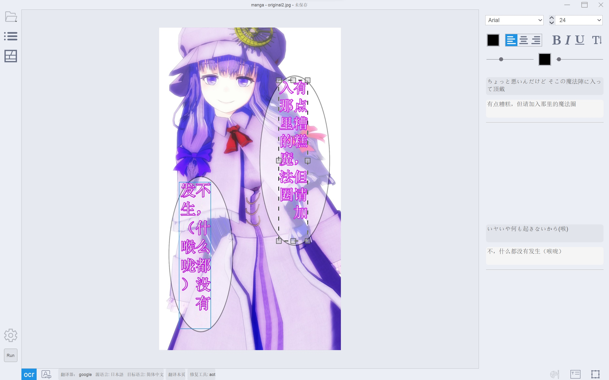
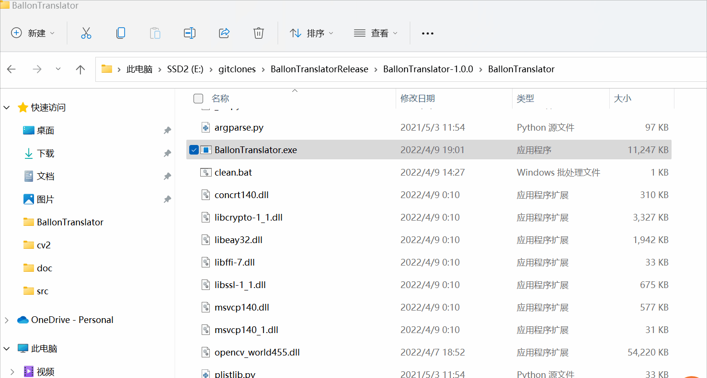
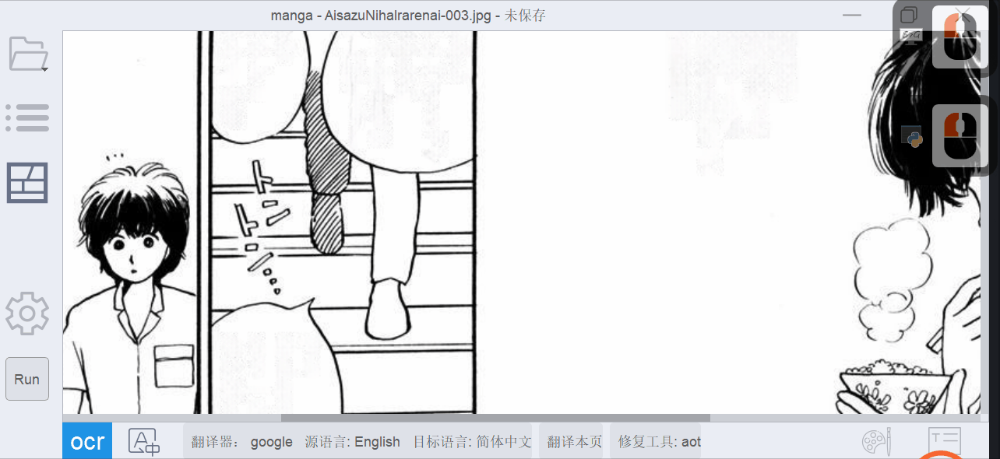
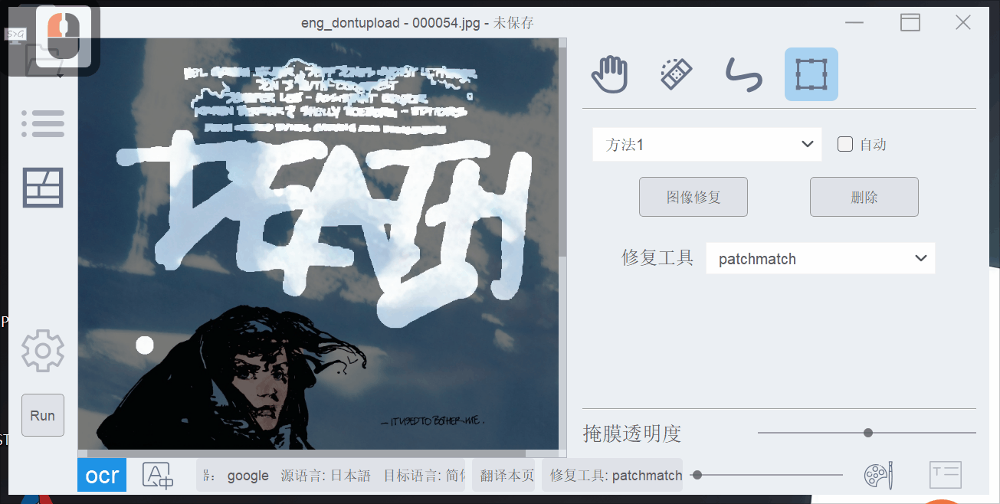
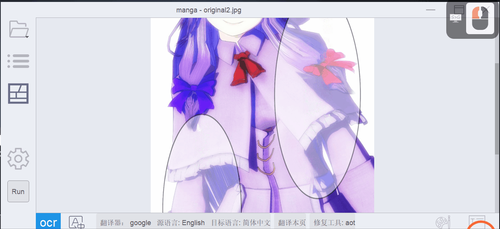
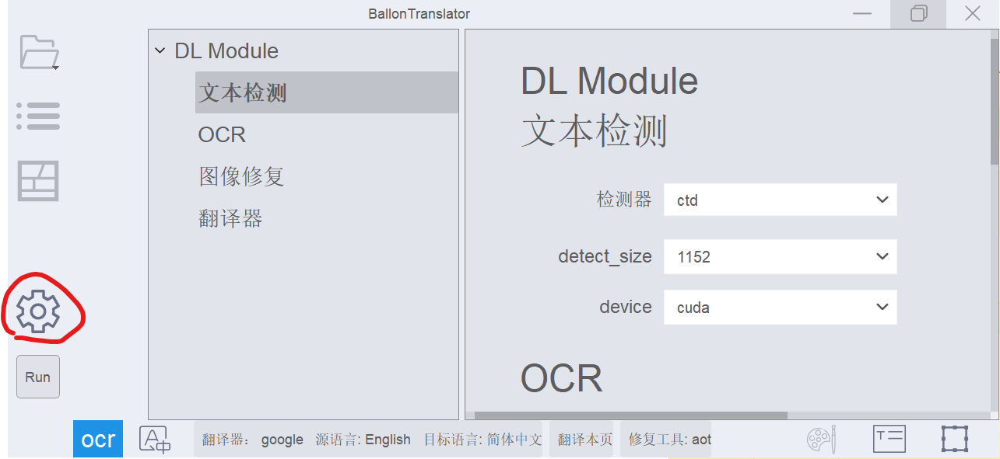

# BallonTranslator

[简体中文](../README.md) | [English](../README_EN.md) | Русский | [日本語](./README_JA.md) | [Indonesia](./README_ID.md) | [Tiếng Việt](./README_VI.md)

Еще один компьютерный инструмент для перевода комиксов/манги, основанный на глубоком обучении.



<p align=center>
Обзор
</p>

# Функции
* Полностью автоматический перевод
  - Поддержка автоматического обнаружения, распознавания, удаления и перевода текста. Общая производительность зависит от этих модулей.
  - Надпись основана на оценке форматирования исходного текста.
  - Хорошо работает с мангой и комиксами.
  - Улучшена верстка манги->английского, английского->китайского языка (на основе извлечения областей из воздушных шаров).
  
* Редактирование изображений
  - Поддержка редактирования и рисования масок (что-то вроде инструмента точечной восстанавливающей кисти в PS)
  - Адаптировано к изображениям с экстремальным соотношением сторон, таким как веб-мультфильмы.
  
* Редактирование текста
  - Поддержка форматированного текста и [предустановок стиля текста](https://github.com/dmMaze/BallonsTranslator/pull/311), переведенные тексты можно редактировать в интерактивном режиме.
  - Поддержка поиска и замены
  - Поддержка экспорта/импорта в/из документов Word.

# Установка

## В Windows
Если вы не хотите самостоятельно устанавливать Python и Git и иметь доступ к Интернету:
Загрузите BallonsTranslator_dev_src_with_gitpython.7z с [MEGA](https://mega.nz/folder/gmhmACoD#dkVlZ2nphOkU5-2ACb5dKw) или [Google Drive](https://drive.google.com/drive/folders/1uElIYRLNakJj-YS0Kd3r3HE-wzeEvrWd?usp=sharing), разархивируйте его и запустите launch_win.bat.
Запустите `scripts/local_gitpull.bat`, чтобы получить последнее обновление.

## Запускаем исходный код

Установите [Python](https://www.python.org/downloads/release/python-31011) **< 3.12** (не используйте версию, установленную из магазина Microsoft) и [Git](https://git-scm.com/downloads).


#### Клонируем репозиторий
```bash
git clone https://github.com/dmMaze/BallonsTranslator.git & 
```
#### Переходим в дирректорию BT
```bash
cd BallonsTranslator
```

#### Запускаем приложение
```bash
python3 launch.py
```

Обратите внимание, что при первом запуске он автоматически установит необходимые библиотеки и загрузит модели. Если загрузка не удалась, вам нужно будет загрузить папку **data** (или отсутствующие файлы, упомянутые в терминале) из [MEGA](https://mega.nz/folder/gmhmACoD#dkVlZ2nphOkU5-2ACb5dKw) или [Google Диск](https://drive.google.com/drive/folders/1uElIYRLNakJj-YS0Kd3r3HE-wzeEvrWd?usp=sharing) и сохраните его по соответствующему пути в папке исходного кода.

## Создайте приложение для macOS (совместимое с кремниевыми чипами Intel и Apple)
<i>Обратите внимание, что macOS также может запустить исходный код, если он не работает.</i>


### 1. Подготовка
- Загрузите библиотеки и модели с [MEGA](https://mega.nz/folder/gmhmACoD#dkVlZ2nphOkU5-2ACb5dKw "MEGA") или [Google Drive](https://drive.google.com/drive/folders/1uElIYRLNakJj). -YS0Kd3r3HE-wzeEvrWd?usp=совместное использование)


- Поместите все загруженные ресурсы в папку data. Окончательная структура дерева каталогов должна выглядеть так:

```
data
├── libs
│   └── patchmatch_inpaint.dll
└── models
    ├── aot_inpainter.ckpt
    ├── comictextdetector.pt
    ├── comictextdetector.pt.onnx
    ├── lama_mpe.ckpt
    ├── manga-ocr-base
    │   ├── README.md
    │   ├── config.json
    │   ├── preprocessor_config.json
    │   ├── pytorch_model.bin
    │   ├── special_tokens_map.json
    │   ├── tokenizer_config.json
    │   └── vocab.txt
    ├── mit32px_ocr.ckpt
    ├── mit48pxctc_ocr.ckpt
    └── pkuseg
        ├── postag
        │   ├── features.pkl
        │   └── weights.npz
        ├── postag.zip
        └── spacy_ontonotes
            ├── features.msgpack
            └── weights.npz

7 directories, 23 files
```

### 2. Установите инструмент командной строки pyenv для управления версиями Python. Рекомендую установить через Homebrew.

#### Установка через Homebrew
```bash
brew install pyenv
```
#### Установка через официальный скрипт
```bash
curl https://pyenv.run | bash
```
#### Установите среду оболочки после установки
```bash
echo 'export PYENV_ROOT="$HOME/.pyenv"' >> ~/.zshrc
echo 'command -v pyenv >/dev/null || export PATH="$PYENV_ROOT/bin:$PATH"' >> ~/.zshrc
echo 'eval "$(pyenv init -)"' >> ~/.zshrc
```


### 3. Создайте приложение
#### Откройте рабочую папку (куда будете скачивать BT)
```bash
cd data
```
#### Клонировать ветку `dev` репозитория
```bash
git clone -b dev https://github.com/dmMaze/BallonsTranslator.git
```
#### Войдите в рабочий каталог BallonsTranslator.
```bash
cd BallonsTranslator
```
#### Запустите сценарий сборки, на этапе pyinstaller запросит пароль, введите пароль и нажмите Enter.
```bash
sh scripts/build-macos-app.sh
```
> 📌Упакованное приложение находится по адресу ./data/BallonsTranslator/dist/BallonsTranslator.app. Перетащите приложение в папку приложений macOS для установки. Готов к использованию без дополнительной настройки Python.


Чтобы использовать переводчик Sugoi (только японско-английский), загрузите [автономную модель](https://drive.google.com/drive/folders/1KnDlfUM9zbnYFTo6iCbnBaBKabXfnVJm), переместите «sugoi_translator» в BallonsTranslator/ballontranslator/data/models.

# Применение

**Рекомендуется запускать программу в терминале на случай, если она выйдет из строя и не оставит никакой информации, см. следующий гиф.**

- При первом запуске приложения выберите переводчик и установите исходный и целевой языки, щелкнув значок настроек.
- Откройте папку, содержащую изображения комиксов (манга/манхуа/манхва), которые необходимо перевести, щелкнув значок папки.
- Нажмите кнопку «RUN» и дождитесь завершения процесса.

Форматы шрифтов, такие как размер и цвет шрифта, автоматически определяются программой в этом процессе. Вы можете заранее определить эти форматы, изменив соответствующие параметры с «выбрать по программе» на «использовать глобальные настройки» на панели конфигурации-> Надписи. (глобальные настройки — это те форматы, которые отображаются на правой панели формата шрифта, когда вы не редактируете какой-либо текстовый блок в сцене)

## Редактирование изображений
### Инструмент закраски

<p align = "center">
Режим редактирования изображения, инструмент закрашивания
</p>

### Прямоугольный инструмент

<p align = "center">
Инструмент «Прямоугольник»
</p>

Чтобы «стереть» нежелательные результаты закрашивания, используйте инструмент закрашивания или инструмент «Прямоугольник», удерживая нажатой **правую кнопку**.
Результат зависит от того, насколько точно алгоритм («метод 1» и «метод 2» на гифке) извлекает текстовую маску. Он может работать хуже со сложным текстом и фоном.

## Редактирование текста

<p align = "center">
Режим редактирования текста
</p>


<p align=center>
Пакетное форматирование текста и автоматический макет
</p>


<p align=center>
OCR и перевод выделенной области
</p>

## Ярлыки
* ```A```/```D``` или ```pageUp```/```Down``` перевернуть страницу
* ```Ctrl+Z```, ```Ctrl+Shift+Z``` для отмены/повтора большинства операций. (обратите внимание, что стек отмены будет очищен после перелистывания страницы)
* ```T``` в режим редактирования текста (или кнопку «T» на нижней панели инструментов).
* ```W```, чтобы активировать режим создания текстового блока, затем перетащите мышь на холст, нажимая правую кнопку, чтобы добавить новый текстовый блок. (см. GIF-изображение для редактирования текста)
* ```P``` в режим редактирования изображений.
* В режиме редактирования изображения используйте ползунок в правом нижнем углу для управления прозрачностью исходного изображения.
* Кнопки «OCR» и «A» на нижней панели инструментов контролируют, включать ли распознавание текста и перевод. Если вы их отключите, программа будет выполнять только обнаружение и удаление текста.
* Установка параметров автоматических модулей в панели конфигурации.
* ```Ctrl++```/```Ctrl+-``` (также ```Ctrl+Shift+=```) для изменения размера изображения.
* ```Ctrl+G```/```Ctrl+F``` для поиска по всему миру/на текущей странице.
* ```0-9``` для настройки непрозрачности слоя с надписью.
* Для редактирования текста: жирный шрифт - ```Ctrl+B```, подчеркивание - ```Ctrl+U```, курсив - ```Ctrl+I```
  
  


# Модули автоматизации
Этот проект сильно зависит от [manga-image-translator](https://github.com/zyddnys/manga-image-translator), онлайн-сервис и обучение моделей стоят недешево, пожалуйста, рассмотрите возможность пожертвования проекта:
- Ko-fi: <https://ko-fi.com/voilelabs>
- Patreon: <https://www.patreon.com/voilelabs>
- 爱发电: <https://afdian.net/@voilelabs>  

[Sugoi translator](https://sugoitranslator.com/) создан [mingshiba](https://www.patreon.com/mingshiba).
  
## Обнаружение текста
Поддержка распознавания текста на английском и японском языках, обучающий код и более подробную информацию можно найти по адресу [comic-text-detector](https://github.com/dmMaze/comic-text-detector)

## распознавание текста
 * Все модели mit* взяты из manga-image-translator, поддерживают распознавание английского, японского и корейского языков и извлечение цвета текста.
 * [manga_ocr](https://github.com/kha-white/manga-ocr) взят из [kha-white](https://github.com/kha-white), распознавание текста для японского языка, с основным фокусом на японской манге.

## Inpainting
  * AOT взят из [manga-image-translator](https://github.com/zyddnys/manga-image-translator).
  * Все ламы* настроены с помощью [LaMa](https://github.com/advimman/lama)
  * PatchMatch — это алгоритм из [PyPatchMatch](https://github.com/vacancy/PyPatchMatch), эта программа использует [модифицированную версию](https://github.com/dmMaze/PyPatchMatchInpaint), разработанную мной.
  

## Переводчики
Доступные переводчики: Google, DeepL, ChatGPT, Sugoi, Caiyun, Baidu. Папаго и Яндекс.
 * Google закрывает службу перевода в Китае. Установите для соответствующего URL-адреса на панели конфигурации значение *.com.
 * [Caiyun](https://dashboard.caiyunapp.com/), [ChatGPT](https://platform.openai.com/playground), [Яндекс](https://yandex.com/dev/translate/ ), [Baidu](http://developers.baidu.com/) и [DeepL](https://www.deepl.com/docs-api/api-access) переводчикам требуется токен или ключ API. .
 * Переводчик DeepL и Sugoi (и преобразование перевода CT2) благодаря [Snowad14](https://github.com/Snowad14).
 * Sugoi переводит с японского на английский полностью в автономном режиме.

Чтобы добавить новый переводчик, обратитесь к [how_to_add_new_translator](how_to_add_new_translator.md), это просто подкласс BaseClass и реализация двух интерфейсов, затем вы можете использовать его в приложении, вы можете внести свой вклад в проект.


## Часто задаваемые вопросы и разное
* Если на вашем компьютере установлен графический процессор Nvidia или процессор Apple, программа включит аппаратное ускорение.
* Добавлена ​​поддержка [saladict](https://saladict.crimx.com) (*профессиональный всплывающий словарь и переводчик страниц «все в одном»*) в мини-меню при выделении текста. [Руководство по установке](saladict.md)
* Увеличьте производительность, если у вас есть [CUDA NVIDIA](https://pytorch.org/docs/stable/notes/cuda.html) или [ROCm AMD](https://pytorch.org/docs/stable/notes/ hip.html), так как большинство модулей используют [PyTorch](https://pytorch.org/get-started/locally/).
* Шрифты взяты из шрифтов вашей системы.
* Спасибо [bropines](https://github.com/bropines) за русскую локализацию.
* Добавлен JSX-скрипт экспорта в Photoshop от [bropines](https://github.com/bropines). </br> Чтобы прочитать инструкции, улучшить код и просто поковыряться, чтобы посмотреть, как он работает, вы можете перейти в `scripts/export to photoshop` -> `install_manual.md`.
