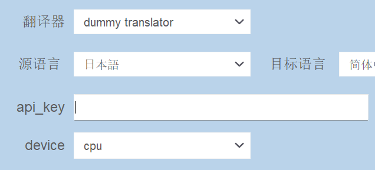

[简体中文](../doc/加别的翻译器.md) | English | [pt-BR](../doc/Como_add_um_novo_tradutor.md) | [Русский](../doc/add_translator_ru.md)

---

If you know how to to call the target translator api or translation model in python, implement a class in ballontranslator/dl/translators.__init__.py as follows to use it in the app.      

The following example DummyTranslator is commented out of ballontranslator/dl/translator/__init__.py and can be uncommented to test in the program.


``` python

# "dummy translator" is the name showed in the app
@register_translator('dummy translator')
class DummyTranslator(BaseTranslator):

    concate_text = True

    # parameters showed in the config panel. 
    # keys are parameter names, if value type is str, it will be a text editor(required key)
    # if value type is dict, you need to spicify the 'type' of the parameter, 
    # following 'device' is a selector, options a cpu and cuda, default is cpu
    params: Dict = {
        'api_key': '', 
        'device': {
            'type': 'selector',
            'options': ['cpu', 'cuda'],
            'value': 'cpu'
        }
    }

    def _setup_translator(self):
        '''
        do the setup here.  
        keys of lang_map are those languages options showed in the app, 
        assign corresponding language keys accepted by API to supported languages.  
        Only the languages supported by the translator are assigned here, this translator only supports Japanese, and English.
        For a full list of languages see LANGMAP_GLOBAL in translator.__init__
        '''
        self.lang_map['日本語'] = 'ja'
        self.lang_map['English'] = 'en'  
        
    def _translate(self, src_list: List[str]) -> List[str]:
        '''
        do the translation here.  
        This translator do nothing but return the original text.
        '''
        source = self.lang_map[self.lang_source]
        target = self.lang_map[self.lang_target]
        
        translation = text
        return translation

    def updateParam(self, param_key: str, param_content):
        '''
        required only if some state need to be updated immediately after user change the translator params,
        for example, if this translator is a pytorch model, you can convert it to cpu/gpu here.
        '''
        super().updateParam(param_key, param_content)
        if param_key == 'device':
            # get current state from params
            # self.model.to(self.params['device']['value'])
            pass

    @property
    def supported_tgt_list(self) -> List[str]:
        '''
        required only if the translator's language supporting is asymmetric, 
        for example, this translator only supports English -> Japanese, no Japanese -> English.
        '''
        return ['English']

    @property
    def supported_src_list(self) -> List[str]:
        '''
        required only if the translator's language supporting is asymmetric.
        '''
        return ['日本語']
```

First the translator must be decorated with register_translator and inherit from the base class BaseTranslator, the 'dummy translator' passed to the decorator is the name of the translator that will be displayed in the interface, be careful not to rename it with an existing translator.  
This ```concate_text``` will be explained later, **set it to False if this translator is a offline model or target api accept str list**.  
``` python
@register_translator('dummy translator')
class DummyTranslator(BaseTranslator):  
    concate_text = True
```

If the new translator requires user-configurable parameters, construct a dictionary named params as below, otherwise leave it alone or assign None to it.  

The keys in params is the corresponding parameter names displayed in the interface, if the corresponding value type is str, it will show in app as a text editor, in following example, the api_key be a text editor with an empty default value.  
The value of the parameter can also be a dictionary, in which case it must be described by 'type', in following example, the 'device' parameter will be shown as a selector in app, valid options are 'cpu' and 'cuda.  
``` python
    params: Dict = {
        'api_key': '', 
        'device': {
            'type': 'selector',
            'options': ['cpu', 'cuda'],
            'value': 'cpu'
        }
    }
```  
<p align = "center">

</p>
<p align = "center">
params displayed in the app's config panel.
</p>  

Implement ```_setup_translator```: initialized the translator here. 

``` python
def _setup_translator(self):
    '''
    do the setup here.  
    keys of lang_map are those languages options showed in the app, 
    assign corresponding language keys accepted by API to supported languages.  
    Only the languages supported by the translator are assigned here, this translator only supports Japanese, and English.
    For a full list of languages see LANGMAP_GLOBAL in translator.__init__
    '''
    self.lang_map['日本語'] = 'ja'
    self.lang_map['English'] = 'en'  
```

Implement ```_translate```, the following lang_source and lang_target are the languages selected in the interface at this point, you can use the previous lang_map to get the corresponding api language keywords and make a request or process text & feed into model here.  
If prementioned ```concate_text``` is set to False, input could be str list(all text recognized in a page) or str, else the input could be concated text of a str list (['text1', 'text2'] -> 'text1 \n###\n text2'), set it to True only if this translator is a online api and don't accept str list to make fewer requests.

``` python
def _translate(self, src_list: List[str]) -> List[str]:
    '''
    do the translation here.  
    This translator do nothing but return the original text.
    '''
    source = self.lang_map[self.lang_source]
    target = self.lang_map[self.lang_target]
    
    translation = text
    return translation
```

Re-implement ```updateParam```, ```supported_tgt_list```, ```supported_src_list``` if necessary, please refer to their comments for further details.

Once the translator is implemented, it is recommended to test it following the example in tests/test_translators.py.