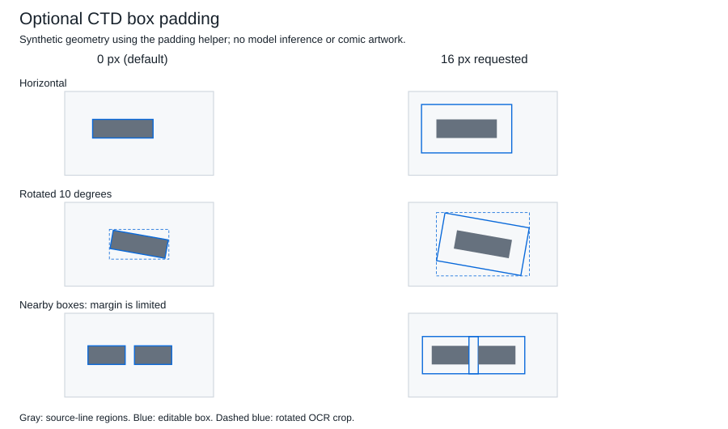

# CTD detection box padding

The built-in `ctd` detector offers **Detect box padding (px)** in its normal
module settings. The default is **0**, preserving existing detection behavior.
Use an integer from 0 to 64; for example, 4 adds four original-image pixels on
each side where space permits. Module configuration saves this setting.
Invalid live values fail before inference or model loading with an actionable
error. No additional models or dependencies are required.
When loading saved configuration, invalid optional padding values warn and
recover to 0 while retaining the remaining settings and the original file.

Padding changes only newly returned horizontal detection boxes. Existing saved
projects are not rewritten. CTD masks, font-size processing, source line polygons,
angles and detector provenance remain unchanged. The editable local rectangle
and outward-rounded `xyxy` represent the padded region. OCR implementations
that crop `xyxy` receive the larger crop; source-line OCR retains its existing
CTD crop correction and original source lines.

Rotated boxes retain their original rotation center and expand in local
coordinates. At page edges, their equal padding reduces rather than moving or
shrinking lettering. Unrotated boxes clip only the extra margin. Vertical source
blocks, invalid geometry and out-of-page source regions retain their original
boxes; diagnostics identify the block index and coordinates for manual review.

Neighbor protection uses the original detected `xyxy` regions, including vertical
and skipped blocks. It selects the largest safe integer padding up to the
configured value whose OCR AABB does not newly intersect an original neighbor.
Touching edges are allowed. For example, with padding 16:

| Original box | Result with a neighboring box 10 pixels away |
| --- | --- |
| `[40, 40, 80, 60]` | `[30, 30, 90, 70]` |
| `[90, 40, 130, 60]` | `[80, 30, 140, 70]` |



Expanded margins can overlap in an otherwise empty gap. The guard protects
detected source regions, not exclusive ownership of empty space or lettering
missed by detection. Pre-existing overlaps skip expansion and are reported;
source boxes are never merged. Results are independent of detection-list order.
One diagnostic per limited or skipped block describes the reason; vertical
classification remains a manual decision.

From the repository root, run the portable regression tests:

```sh
python -m unittest discover -s tests -p test_ctd_padding.py
python -m unittest discover -s tests -p test_lazy_metadata.py
```

Tests use the checkout's real detector, lazy metadata scanner and `TextBlock`,
with expensive model inference/loading stubbed. They cover zero compatibility,
padding values, rotated geometry, page edges, neighbors, source-line crops,
mask/font preservation and configuration roundtrips. Synthetic checks do not
establish real-image inference quality or visual acceptance.
