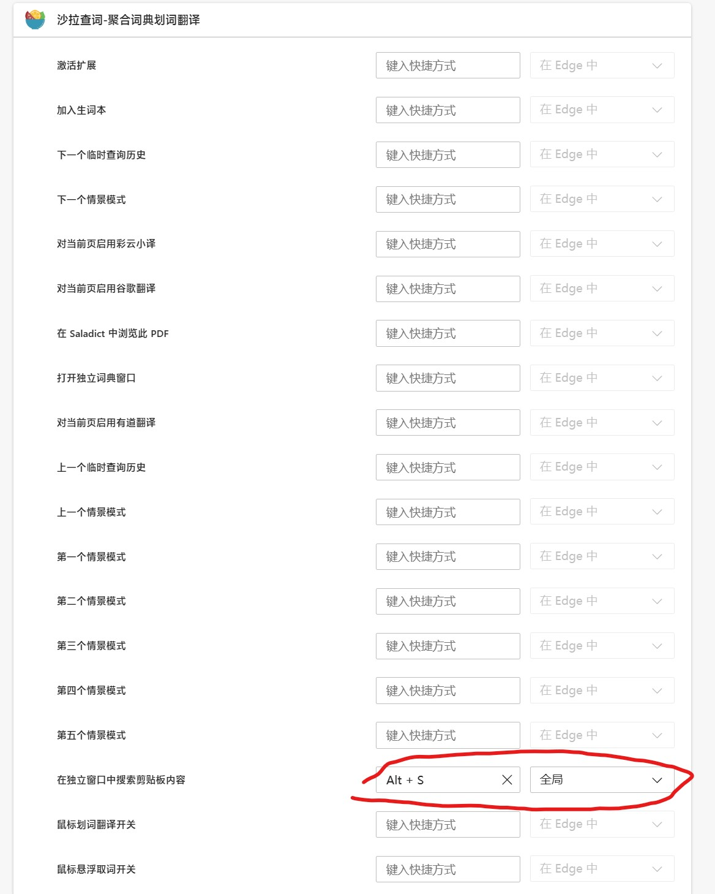
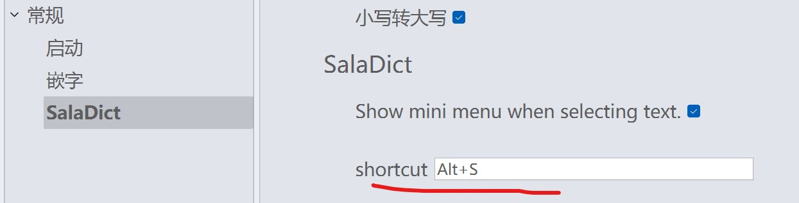

[简体中文](../saladict_chs.md)

Note it only work with browsers that offer global shortcuts for extensions(Currently only Firefox does no support global shortcuts)

1. Installation: https://saladict.crimx.com/download.html 
2. In Saladict options, enable "Keep in Background", enable "Permissions" - 'Read Clipboard".
3. In browser(edge://extensions/shortcuts or chrome://extensions/shortcuts), set a **global** shortcut for ```Search clipboard content in Standalone Panel```：



**Note the shortcut in browser should be the same as in the ballonstranslator**, with "ALT+S" by default: 

